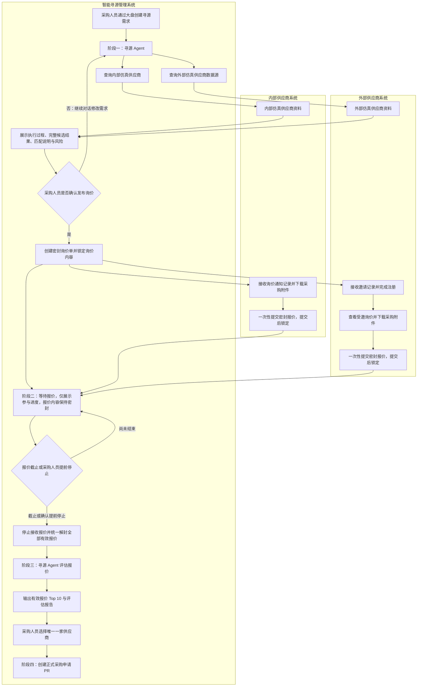

# 海天智能寻源与密封报价 Demo 产品需求文档

## 1. 文档信息

- 文档编号：0001
- 文档类型：产品需求文档
- 文档状态：需求已确认
- 适用范围：智能寻源管理系统、内部供应商系统、外部供应商系统

## 2. 产品概述

### 2.1 产品背景

现有采购寻源主要依赖已合作的供应商，外部供应商发现、邀请、注册、报价和评估之间缺少连续流程。采购人员难以在一个任务中同时查看内部资源和外部市场资源，也缺少统一、可追踪的密封询价和报价评估过程。

本产品需要构建一套看起来真实、能够完整操作的寻源 Demo。采购人员从创建寻源需求开始，通过寻源 Agent 查找候选供应商，向内部和外部供应商发布密封询价，等待供应商提交报价，再由 Agent 对解封后的报价进行评估，最终选择一家供应商并创建正式采购申请 PR。

### 2.2 产品目标

本产品需要实现以下目标：

1. 将采购需求、供应商寻源、询价、报价、评估和采购申请串联成完整闭环。
2. 同时覆盖内部供应商和外部供应商两类资源。
3. 通过真实的 Agent 对话展示需求修改、供应商查询、结果解释和报价评估过程。
4. 通过严格密封报价保护报价信息，在报价结束前不向采购人员或 Agent 展示任何报价内容。
5. 让外部候选供应商能够通过邀请完成注册并参与报价。
6. 保证业务数据、状态、记录和操作结果可以持续保存并在三个系统之间保持一致。

### 2.3 产品范围

本需求包含三个相互协作的系统：

1. 智能寻源管理系统
   - 采购寻源大盘。
   - 寻源需求列表。
   - 寻源需求创建与详情。
   - 寻源 Agent 对话。
   - 询价进度、报价解封、Agent 评估和采购申请 PR 创建。

2. 内部供应商系统
   - 内部供应商使用预置身份进入系统。
   - 查看收到的询价。
   - 下载采购附件。
   - 提交一次密封报价。
   - 查看自己的报价回执和通知记录。

3. 外部供应商系统
   - 外部候选供应商通过邀请进入注册流程。
   - 使用仿真企业资料完成注册。
   - 查看被邀请参与的询价。
   - 下载采购附件。
   - 提交一次密封报价。
   - 查看自己的报价回执和通知记录。

## 3. 核心术语

### 3.1 寻源需求

由采购人员创建的内部寻源任务，包含采购物品、数量、标准、交期、供应商资质、报价截止时间、评估权重和附件等信息。寻源需求是整个流程的起点。

### 3.2 候选供应商

寻源 Agent 根据需求从内部供应商数据和外部仿真供应商数据源中找到的、可能符合要求的供应商。

### 3.3 询价单 RFQ

采购人员确认候选供应商后，对内部和外部供应商发布的正式报价邀请。询价单进入报价阶段后采用密封报价规则。

### 3.4 密封报价

供应商提交报价后，报价内容在报价截止或采购人员提前停止报价之前保持密封。采购人员、其他供应商和寻源 Agent 均不能读取报价内容。

### 3.5 报价单

供应商针对某一询价单提交的正式报价信息。每家供应商对同一询价单只能提交一次，提交后不可修改或撤回。

### 3.6 采购申请 PR

采购人员在报价解封、Agent 评估并选择一家供应商后创建的正式采购申请。采购申请不是采购订单。

## 4. 用户角色

### 4.1 采购人员

采购人员可以：

- 查看寻源大盘和全部寻源需求。
- 创建、修改尚未发布询价的寻源需求。
- 与寻源 Agent 对话并调整需求。
- 查看内部和外部候选供应商。
- 确认并发布询价。
- 在报价期间查看供应商参与进度，但不能查看报价内容。
- 提前停止报价。
- 在报价结束后查看全部有效报价。
- 启动 Agent 报价评估。
- 查看 Top 10 评估结果。
- 选择一家供应商并创建采购申请 PR。

### 4.2 内部供应商

内部供应商可以：

- 使用预置身份进入内部供应商系统。
- 查看分配给自己的询价及截止时间。
- 下载询价附件。
- 对询价提交一次报价。
- 查看自己的已提交报价和提交回执。
- 查看与自己相关的通知记录。

内部供应商不能：

- 查看其他供应商是否被邀请。
- 查看其他供应商的身份、报价和提交状态。
- 修改或撤回已经提交的报价。
- 在报价截止或提前停止后继续提交报价。

### 4.3 外部供应商

外部供应商可以：

- 通过专属邀请进入注册流程。
- 使用仿真资料完成企业和账号注册。
- 注册后查看邀请中指定的询价。
- 下载询价附件。
- 对询价提交一次报价。
- 查看自己的已提交报价和提交回执。
- 查看与自己相关的邀请和通知记录。

外部供应商不能：

- 在没有有效邀请的情况下参与询价。
- 查看不属于自己的询价。
- 查看其他供应商的身份、报价和提交状态。
- 修改或撤回已经提交的报价。
- 在报价截止或提前停止后继续提交报价。

### 4.4 寻源 Agent

寻源 Agent 负责：

- 理解采购人员录入的结构化需求和对话补充信息。
- 查询内部仿真供应商数据。
- 查询带有 1688、行业平台、企业信息库等来源标识的外部仿真供应商数据。
- 展示查询过程、筛选过程、候选结果、匹配原因和风险信息。
- 根据采购人员的对话修改需求并重新执行寻源。
- 在报价结束并解封后，对全部有效报价进行评估。
- 输出 Top 10 和可解释的评估报告。

寻源 Agent 不能：

- 凭空编造数据库中不存在的供应商。
- 读取采购需求中上传的附件内容。
- 在报价结束前读取任何供应商的报价内容。
- 自动决定最终中选供应商。
- 自动创建采购申请 PR。

## 5. 整体业务流程

### 5.1 阶段一：Agent 寻源

1. 采购人员创建寻源需求。
2. 寻源需求创建成功后进入“Agent 寻源”阶段。
3. 系统将寻源需求中的结构化信息和内部业务提示发送给寻源 Agent。
4. Agent 在对话中展示当前理解的采购需求。
5. Agent 查询内部仿真供应商数据。
6. Agent 查询带有外部平台来源标识的仿真供应商数据。
7. Agent 展示查询、筛选和汇总过程。
8. Agent 完整展示符合条件的内部和外部候选供应商，并说明匹配原因、未满足项和风险信息。
9. Agent 询问采购人员是否确认候选供应商范围并发布询价。
10. 如果采购人员认为需求或结果有问题，可以继续通过对话修改需求。
11. 需求修改后，之前的候选结果失效，Agent 根据最新需求重新寻源。
12. 采购人员可以通过对话要求增加或排除候选供应商。
13. 采购人员确认后，系统创建询价单并进入密封报价流程。

### 5.2 阶段二：等待报价

1. 系统为符合条件的内部供应商生成询价通知记录。
2. 内部供应商在内部供应商系统中查看询价、下载附件并提交报价。
3. 系统为符合条件的外部供应商生成注册邀请和询价通知记录。
4. 外部供应商通过邀请完成注册后，进入外部供应商系统查看询价、下载附件并提交报价。
5. 采购人员可以查看邀请、查看、注册和提交进度。
6. 报价内容在此阶段保持密封。
7. 采购人员可以等待报价截止时间自动结束报价，也可以提前停止报价。
8. 报价结束后不再接受新报价。
9. 所有截止前成功提交的有效报价同时解封。

### 5.3 阶段三：Agent 评估报价

1. 只有报价已经结束并解封，采购人员才能启动 Agent 评估。
2. Agent 获取寻源需求、评估规则、供应商资料和全部有效报价。
3. Agent 先检查硬性条件，再对符合硬性条件的报价进行权重评分。
4. Agent 输出最多十家供应商的综合评估结果。
5. 如果有效报价不足十家，则展示全部有效报价。
6. Agent 输出排名、评分明细、推荐原因、优势、风险和关键差异。
7. 采购人员查看评估结果并选择一家供应商。

### 5.4 阶段四：创建采购申请 PR

1. 采购人员只能从有效报价中选择一家供应商。
2. 采购人员确认中选供应商和报价。
3. 系统根据寻源需求、中选报价和评估报告创建采购申请 PR。
4. 采购申请创建成功后，整个寻源流程完成。

## 6. 智能寻源管理系统需求

### 6.1 寻源大盘

大盘需要总体展示全部采购寻源工作的当前情况，至少包括：

- 寻源需求总数。
- Agent 寻源中的需求数。
- 等待报价中的需求数。
- 待评估的需求数。
- 待选择供应商的需求数。
- 已创建采购申请 PR 的需求数。
- 即将到达报价截止时间的需求数。
- 已逾期或需要处理的异常需求数。

大盘需要提供寻源需求列表，至少展示：

- 寻源需求编号。
- 需求名称或采购物品。
- 采购数量和单位。
- 当前阶段和状态。
- 当前负责人。
- 候选供应商数量。
- 已邀请供应商数量。
- 已提交报价数量。
- 报价截止时间。
- 创建时间。
- 当前需要执行的下一步操作。

列表需要支持按以下条件查找或筛选：

- 需求编号或采购物品。
- 当前阶段。
- 当前状态。
- 负责人。
- 报价截止时间。
- 是否存在待处理异常。

### 6.2 创建寻源需求

创建寻源需求时，至少需要填写或选择以下内容：

- 需求名称。
- 采购物品。
- 物品编码或分类。
- 规格型号。
- 执行标准或技术标准。
- 采购数量和单位。
- 期望交付日期或交期要求。
- 质量要求。
- 供应商必须具备的资质。
- 供应商所在区域要求，可选。
- 预算或目标价格，可选。
- 报价截止日期和时间。
- 报价评估权重。
- 采购说明和补充要求。
- 采购附件。

创建规则：

- 必填项未完成时不能创建寻源需求。
- 报价截止时间必须晚于创建时间。
- 评估权重总和必须等于 100%。
- 创建成功后立即生成寻源需求记录，并进入“Agent 寻源”阶段。
- 上传附件仅供被邀请的供应商下载，寻源 Agent 不读取或解析附件内容。
- 所有报价截止日期和时间统一按中国标准时间展示和判断。

### 6.3 寻源需求详情

寻源需求详情需要持续展示四个主阶段：

1. Agent 寻源。
2. 等待报价。
3. Agent 评估报价。
4. 创建采购申请 PR。

详情中必须有步骤条，并明确展示：

- 当前所处阶段。
- 已完成阶段。
- 尚未开始阶段。
- 每个阶段的开始时间、结束时间和当前状态。
- 当前阶段可以执行的操作。

详情还需要汇总展示：

- 寻源需求完整内容。
- 附件列表。
- Agent 对话和过程记录。
- 候选供应商结果。
- 询价邀请和报价提交进度。
- 报价结束后的报价内容。
- Agent 评估报告。
- 中选供应商及采购申请 PR 信息。
- 全部关键操作记录。

### 6.4 寻源 Agent 对话

Agent 对话需要满足以下要求：

- 使用真实的 DeepSeek 服务生成对话和分析内容，不能使用预先写死的固定回答冒充 Agent 对话。
- 对话开始时自动带入当前寻源需求和内部业务提示。
- 明确展示 Agent 当前理解的需求。
- 展示查询内部供应商的过程和结果。
- 展示查询外部仿真数据源的过程和结果。
- 展示供应商筛选、匹配和风险检查过程。
- 将内部和外部候选供应商分组展示。
- 对每家候选供应商说明数据来源、匹配项、不满足项和风险提示。
- 允许采购人员通过自然语言修改需求、增加限制、放宽条件、排除或增加候选供应商。
- 每次修改后都应明确展示更新后的需求，并重新执行受影响的寻源过程。
- 在用户确认前不能发布询价。
- 用户确认时，Agent 应明确询问“是否确认创建并发布询价单”，不能将此操作描述为创建采购申请 PR。

### 6.5 候选供应商结果

候选供应商结果至少包括：

- 供应商名称。
- 内部供应商或外部供应商标识。
- 外部供应商的数据来源标识。
- 所在地区。
- 可供应的物品或能力范围。
- 资质信息。
- 能力匹配情况。
- 风险等级和风险说明。
- 推荐原因。
- 不完全满足的条件。
- 是否纳入本次询价邀请。

采购人员确认发布询价前，可以继续通过 Agent 对话调整候选供应商范围。

### 6.6 询价发布

采购人员确认发布询价时，系统需要：

- 展示最终询价内容。
- 展示最终邀请的内部供应商和外部供应商数量。
- 展示报价截止时间。
- 展示密封报价规则。
- 明确提示发布后供应商只能提交一次报价。
- 要求采购人员再次确认。

询价发布后：

- 询价核心内容、评估权重、附件和最终邀请的供应商范围同时锁定。
- 系统分别生成内部供应商通知记录和外部供应商邀请记录。
- 寻源需求进入“等待报价”阶段。
- 如确需改变核心采购要求，应结束当前询价并重新创建寻源需求或询价，不能直接修改正在报价的询价内容。

### 6.7 等待报价管理

等待报价阶段，采购人员可以查看：

- 邀请供应商总数。
- 内部供应商和外部供应商数量。
- 已生成通知记录数量。
- 外部供应商已注册数量。
- 已查看询价数量。
- 已提交报价数量。
- 尚未提交报价数量。
- 每家供应商的邀请、注册、查看和提交状态。
- 报价提交时间。
- 距离截止时间的剩余时间。

等待报价阶段，采购人员不能查看：

- 单价和总价。
- 交期承诺。
- 付款条件。
- 质保和服务条件。
- 报价备注。
- 报价附件。
- 任何可以推断具体报价内容的信息。

供应商是否已提交及其提交时间不属于报价内容，可以向采购人员展示。

### 6.8 提前停止报价

采购人员可以在报价截止前提前停止报价。

提前停止需要满足以下规则：

- 操作前必须再次确认。
- 明确提示尚未提交的供应商将失去本次报价机会。
- 采购人员必须填写提前停止原因。
- 记录操作人、操作时间和停止原因。
- 停止后立即拒绝所有新的报价提交。
- 所有已成功提交的有效报价同时解封。
- 提前停止不可撤销。
- 无论当前已收到多少份报价，采购人员都可以提前停止；如果没有有效报价，则不能进入正常评估和供应商选择流程。

### 6.9 报价解封

报价可通过以下两种方式结束并解封：

1. 到达报价截止时间自动结束。
2. 采购人员提前停止报价。

解封后：

- 采购人员可以查看全部有效报价内容。
- 寻源 Agent 可以读取全部有效报价内容并进行评估。
- 供应商仍然只能查看自己的报价，不能查看其他供应商报价。
- 未在截止前成功提交的内容不属于有效报价。
- 报价内容继续保持只读，不能被供应商修改。

### 6.10 Agent 报价评估

#### 6.10.1 评估前提

- 报价阶段必须已经结束。
- 报价必须已经解封。
- 至少存在一份有效报价。
- 只有采购人员可以启动评估。

#### 6.10.2 硬性条件

Agent 首先检查报价是否满足硬性条件，至少包括：

- 采购物品和规格是否匹配。
- 强制技术标准是否满足。
- 必须具备的供应商资质是否满足。
- 数量是否能够满足。
- 最晚交期是否能够满足。

不满足硬性条件的报价需要明确标记为“不合格”，并说明具体原因。不合格报价不进入正常推荐排名。

#### 6.10.3 默认评估权重

符合硬性条件的报价按以下默认权重进行评估：

| 评估维度 | 默认权重 |
| --- | ---: |
| 报价 | 40% |
| 交期 | 20% |
| 技术和规格匹配 | 20% |
| 供应商资质及风险 | 15% |
| 付款、质保等商务条件 | 5% |
| 合计 | 100% |

权重规则：

- 采购人员可以在创建寻源需求时调整每个维度的权重。
- 权重总和必须等于 100%。
- 询价发布后权重锁定，不能在看到报价后修改。
- Agent 必须按照当前寻源需求中已锁定的权重进行评估。

#### 6.10.4 Top 10 评估报告

评估报告至少包括：

- 综合排名。
- 供应商名称。
- 内部或外部供应商标识。
- 报价单价和总价。
- 承诺交期。
- 各维度得分。
- 综合得分。
- 硬性条件检查结果。
- 供应商资质和风险说明。
- 主要优势。
- 主要不足。
- 推荐理由。
- 与其他报价的关键差异。

有效报价超过十家时展示综合排名前十；不足十家时展示全部有效报价。采购人员仍可以查看未进入 Top 10 的其他有效报价。

### 6.11 选择供应商

- 采购人员从有效报价中选择一家供应商。
- 一次寻源需求只能选择一家最终供应商。
- 不合格报价不能被选择。
- 选择前需要查看中选报价摘要和 Agent 评估结论。
- 选择操作需要再次确认。
- 记录选择人和选择时间。
- Agent 不得代替采购人员完成选择。

### 6.12 创建采购申请 PR

采购申请 PR 至少需要包含：

- 唯一的采购申请 PR 编号。
- 对应寻源需求编号。
- 采购物品、规格、标准、数量和单位。
- 采购附件引用。
- 中选供应商。
- 中选报价单。
- 单价、总价和商务条件。
- 交付要求。
- Agent 评估报告引用。
- 采购人员的选择记录。
- 采购申请创建人和创建时间。

采购申请创建成功后：

- 寻源需求状态更新为“已创建采购申请 PR”。
- 四阶段流程标记为完成。
- 采购申请、寻源需求、询价单、中选报价和评估报告可以相互追溯。
- 同一寻源需求只能成功创建一份采购申请 PR，重复操作不能生成多份记录。
- 本期创建成功的采购申请 PR 只读展示，不包含修改、撤回或审批流程。

## 7. 内部供应商系统需求

### 7.1 询价列表

内部供应商只能看到与自己相关的询价，列表至少展示：

- 询价单号。
- 采购物品。
- 采购数量。
- 报价截止时间。
- 当前状态。
- 是否已查看。
- 是否已提交报价。

### 7.2 询价详情

内部供应商可以查看：

- 采购物品、规格和标准。
- 采购数量和单位。
- 质量要求。
- 资质要求。
- 交期要求。
- 报价截止时间。
- 采购说明。
- 可下载的采购附件。
- 密封报价和单次提交规则。

内部供应商不能看到邀请名单和其他供应商信息。

### 7.3 报价提交

内部供应商报价至少包括：

- 报价单价。
- 报价总价。
- 币种。
- 是否含税及税率。
- 是否包含运输费用。
- 可交付数量。
- 承诺交付日期或交期。
- 付款条件。
- 报价有效期。
- 质保和服务说明。
- 偏差说明和补充备注。
- 报价附件，可选。

提交规则：

- 每家供应商对同一询价只能提交一次。
- 正式提交前可以检查和修改尚未提交的报价内容；完成最终确认并正式提交后即永久锁定。
- 提交前需要完整预览报价内容并再次确认。
- 提交成功后生成不可变更的提交回执。
- 提交后可以查看自己的报价，但不能修改或撤回。
- 截止时间到达或采购人员提前停止后不能提交。
- 供应商不能查看其他供应商报价。

## 8. 外部供应商系统需求

### 8.1 邀请注册

外部候选供应商收到的是系统内生成的模拟邀请记录，不实际发送邮件或短信。

每条邀请至少记录：

- 被邀请供应商。
- 对应询价单。
- 邀请渠道。
- 模拟接收地址。
- 邀请生成时间。
- 邀请内容。
- 专属注册链接。
- 当前邀请状态。

邀请注册链接只能用于对应的外部供应商和询价。

邀请在报价截止或采购人员提前停止后失效；失效后不能再用于注册并参与该询价。

### 8.2 外部供应商注册

外部供应商需要完成真实可操作的注册流程，但注册资料使用仿真数据，不进行真实企业核验。

注册至少包括：

- 企业名称。
- 统一社会信用代码或仿真企业识别信息。
- 联系人姓名。
- 联系电话。
- 联系邮箱。
- 登录密码。
- 企业所在地区。
- 主要供应能力或品类。
- 资质声明。
- 同意相关注册和报价规则。

注册成功后：

- 外部候选供应商转为已注册外部供应商。
- 账号与原邀请和询价自动关联。
- 供应商可以进入对应询价并参与报价。
- 注册信息需要持续保存，可用于后续其他询价邀请。

### 8.3 外部询价与报价

外部供应商查看询价、下载附件和提交报价的业务规则与内部供应商一致。

外部供应商只能查看通过邀请分配给自己的询价，不得浏览其他采购需求或其他供应商信息。

## 9. 密封报价规则

### 9.1 密封范围

以下内容在报价结束前全部属于密封内容：

- 报价单价和总价。
- 税费和运输费用。
- 可供应数量。
- 交期承诺。
- 付款条件。
- 报价有效期。
- 质保和服务条件。
- 偏差说明和备注。
- 报价附件。

### 9.2 报价期间可见信息

采购人员可以看到：

- 供应商是否被邀请。
- 外部供应商是否完成注册。
- 供应商是否查看询价。
- 供应商是否提交报价。
- 报价提交时间。

采购人员不能看到或通过任何汇总信息推断报价内容。

寻源 Agent 在报价期间同样不能访问报价内容，只能获得报价进度信息。

### 9.3 报价解封规则

- 所有有效报价必须同时解封，不能逐家解封。
- 解封只发生在到达截止时间或提前停止报价之后。
- 以系统记录的报价结束时间为准，在该时间之前或同时完成正式提交的报价才属于有效报价。
- 解封前不能启动 Agent 评估。
- 解封后采购人员和 Agent 才能读取报价内容。
- 供应商无论何时都不能查看其他供应商报价。

## 10. 通知与发送记录

本 Demo 不实际发送邮件、短信或外部消息，所有通知只生成可查看的发送记录。

通知记录至少包括：

- 通知类型。
- 接收方。
- 模拟发送渠道。
- 模拟接收地址。
- 通知标题和内容。
- 关联的寻源需求或询价单。
- 生成时间。
- 当前状态。

需要记录的通知至少包括：

- 内部供应商询价通知。
- 外部供应商注册邀请。
- 外部供应商询价邀请。
- 报价即将截止提醒。
- 报价提交成功回执。
- 报价提前停止通知。
- 报价正常截止通知。

## 11. 状态定义

| 主阶段 | 业务状态 | 说明 |
| --- | --- | --- |
| Agent 寻源 | 草稿 | 寻源需求尚未创建完成 |
| Agent 寻源 | 寻源中 | Agent 正在查询和筛选候选供应商 |
| Agent 寻源 | 等待确认 | 候选供应商已展示，等待采购人员确认发布询价 |
| 等待报价 | 报价中 | 询价已发布，供应商可以提交密封报价 |
| 等待报价 | 已提前停止 | 采购人员提前停止报价，报价已解封 |
| 等待报价 | 已截止 | 到达截止时间，报价已解封 |
| Agent 评估报价 | 待评估 | 报价已解封，尚未启动评估 |
| Agent 评估报价 | 评估中 | Agent 正在评估有效报价 |
| Agent 评估报价 | 待选择 | Agent 已输出评估报告，等待采购人员选择供应商 |
| 创建采购申请 PR | 待创建 PR | 已选择供应商，尚未创建采购申请 |
| 创建采购申请 PR | 已完成 | 采购申请 PR 创建成功 |
| 全流程 | 已取消 | 寻源任务被终止且不再继续 |

状态变化需要保存操作人、变化时间和变化原因。

## 12. 权限与信息隔离

| 信息或操作 | 采购人员 | 内部供应商 | 外部供应商 | 寻源 Agent |
| --- | --- | --- | --- | --- |
| 查看寻源需求 | 可以 | 仅查看分配给自己的询价内容 | 仅查看邀请关联的询价内容 | 可以读取结构化需求 |
| 查看采购附件 | 可以 | 可以下载所属询价附件 | 可以下载所属询价附件 | 不可读取附件内容 |
| 查看候选供应商 | 可以 | 不可以 | 不可以 | 可以 |
| 查看报价提交状态 | 可以 | 仅查看自己的状态 | 仅查看自己的状态 | 仅查看汇总进度 |
| 报价结束前查看报价内容 | 不可以 | 仅查看自己的已提交报价 | 仅查看自己的已提交报价 | 不可以 |
| 报价结束后查看全部报价 | 可以 | 不可以 | 不可以 | 可以 |
| 提交报价 | 不可以 | 可以提交一次 | 可以提交一次 | 不可以 |
| 提前停止报价 | 可以 | 不可以 | 不可以 | 不可以 |
| 启动报价评估 | 可以 | 不可以 | 不可以 | 被启动后执行评估 |
| 选择中选供应商 | 可以 | 不可以 | 不可以 | 不可以 |
| 创建采购申请 PR | 可以 | 不可以 | 不可以 | 不可以 |

## 13. 异常和边界处理

### 13.1 没有候选供应商

- Agent 明确说明没有找到满足全部条件的供应商。
- 展示未匹配的主要原因。
- 允许采购人员通过对话修改或放宽条件后重新寻源。
- 未找到候选供应商时不能发布询价。

### 13.2 外部供应商未注册

- 外部供应商在截止前未完成注册，则不能提交报价。
- 管理系统持续展示“未注册”状态。
- 未注册供应商不计入已提交报价数量。

### 13.3 没有有效报价

- 没有有效报价时不能启动正常的 Top 10 评估。
- 不能选择供应商或创建采购申请 PR。
- 采购人员可以结束当前流程并重新发起寻源需求。

如果存在报价但全部未通过硬性条件，则同样不能选择供应商或创建采购申请 PR；评估结果需要逐条说明不合格原因。

### 13.4 有效报价不足十家

- Agent 评估全部有效报价。
- 结果标题不应误导为一定存在十家供应商。

### 13.5 重复提交报价

- 首次成功提交后，后续提交均被拒绝。
- 供应商继续看到首次提交的只读报价和回执。

### 13.6 超过截止时间提交

- 到达截止时间后立即停止接受新报价。
- 截止前未成功完成提交的报价不视为有效报价。

### 13.7 Agent 执行失败

- 明确展示失败状态和失败发生的阶段。
- 保留已经创建的寻源需求和历史对话。
- 允许采购人员重新执行失败的寻源或评估操作。
- 重新执行不能改变已经锁定的询价内容和评估权重。

### 13.8 提前停止报价

- 提前停止后不可恢复报价状态。
- 尚未提交的供应商失去提交机会。
- 已提交的报价同时解封并进入待评估状态。

## 14. Demo 真实性要求

- 寻源需求、供应商、邀请、注册、询价、报价、评估和采购申请均为可以真实创建和持续保存的业务记录。
- 页面刷新或重新进入系统后，业务记录和流程状态不能丢失。
- 内部供应商、外部供应商和采购人员看到的内容必须符合各自权限。
- Agent 对话和评估使用真实的 DeepSeek 服务，不使用固定脚本冒充实时 Agent。
- 供应商查询结果来自预先准备并持续保存的仿真供应商数据，Agent 不得自行编造供应商。
- 外部数据可以带有 1688、行业平台、企业信息库等仿真来源标识，但不要求接入真实外部平台。
- 外部供应商注册为真实可操作流程，但企业资料不要求真实，也不进行真实资质核验。
- 邮件、短信和站内邀请只生成发送记录，不真实发送。
- 关键操作必须可以追溯，包括创建、修改、确认发布、提交报价、提前停止、解封、评估、选择供应商和创建 PR。

## 15. 本期不包含的内容

本期明确不包含：

- 对接真实的 1688、行业平台或企业信息平台。
- 真实发送邮件、短信或外部消息。
- 对外部供应商进行真实工商、资质或征信核验。
- 让 Agent 读取或解析采购附件、图纸和技术文件。
- 让 Agent 读取或解析供应商上传的报价附件；评估以结构化报价字段为准。
- 供应商多次报价、修改报价或撤回报价。
- 采购人员在报价结束前查看报价内容。
- 供应商查看其他供应商或其他报价。
- 一次寻源选择多家供应商或拆分采购数量。
- 自动决定中选供应商。
- 自动创建采购申请 PR。
- 创建采购订单 PO。
- 与真实 ERP、SRM 或采购审批系统集成。
- 页面视觉稿、交互视觉设计和技术实现方案。

## 16. 核心验收场景

### 16.1 创建并完成 Agent 寻源

1. 采购人员创建包含物品、标准、资质要求、截止时间、权重和附件的寻源需求。
2. 寻源需求进入 Agent 寻源阶段。
3. Agent 使用真实对话查询内部和外部仿真供应商数据。
4. Agent 展示过程和候选结果。
5. 采购人员通过对话修改条件后，Agent 使用最新条件重新寻源。
6. 采购人员确认候选范围并发布询价。

### 16.2 内部供应商提交密封报价

1. 内部供应商看到询价通知记录。
2. 内部供应商查看需求并下载附件。
3. 内部供应商预览并确认报价。
4. 报价提交成功并生成回执。
5. 再次提交或修改报价被拒绝。

### 16.3 外部供应商注册并报价

1. 系统生成外部供应商注册邀请记录。
2. 外部供应商通过邀请完成仿真资料注册。
3. 注册账号自动关联对应询价。
4. 外部供应商下载附件并提交一次报价。
5. 报价提交成功并生成回执。

### 16.4 验证严格密封报价

1. 报价期间，采购人员只能看到邀请、注册、查看和提交状态。
2. 报价期间，采购人员无法查看任何报价字段和报价附件。
3. 报价期间，寻源 Agent 无法读取任何报价内容。
4. 供应商无法查看其他供应商信息和报价。
5. 到达截止时间或提前停止后，全部有效报价同时解封。

### 16.5 提前停止报价

1. 采购人员点击提前停止。
2. 系统展示影响并要求填写停止原因和再次确认。
3. 提前停止后拒绝新报价。
4. 已提交报价同时解封。
5. 操作人、时间和原因被完整记录。

### 16.6 Agent 评估与 Top 10

1. 报价解封后采购人员启动 Agent 评估。
2. Agent 先检查硬性条件。
3. Agent 按已锁定权重进行评分。
4. Agent 输出 Top 10 或全部有效报价。
5. 每份结果包含评分明细、优势、风险和推荐原因。

### 16.7 选择供应商并创建采购申请 PR

1. 采购人员从合格报价中选择一家供应商。
2. 系统要求再次确认。
3. 系统创建包含需求、中选报价和评估报告引用的采购申请 PR。
4. 寻源流程状态更新为已完成。
5. 相关业务记录可以相互追溯。
