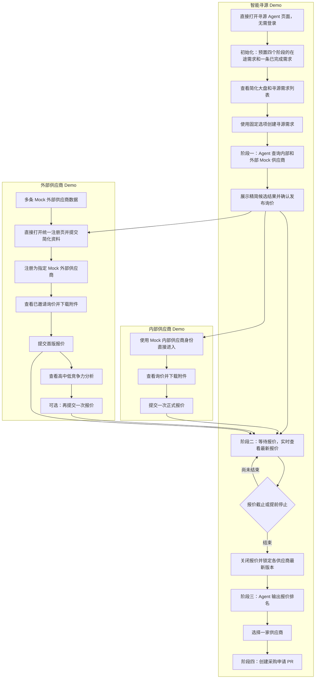

# 海天智能寻源 Demo 精简版产品需求

## 1. 文档信息

- 文档编号：0002_simple
- 文档类型：精简版产品需求文档
- 目标：以最少功能完整演示“创建寻源需求、Agent 寻源、供应商报价、竞争力反馈、Agent 评估、创建采购申请 PR”流程
- 改造范围：现有海天 Demo 中的寻源 Agent 页面，以及配套的内部供应商 Demo 和外部供应商 Demo

## 2. 精简原则

本版本只服务于现场演示，不建设完整采购平台。

1. 寻源 Agent 页面打开后即可操作，不设置登录和采购人员角色管理。
2. 内部和外部供应商均使用预置 Mock 数据。
3. 外部供应商准备多条 Mock 数据，但只完整演示一家供应商直接提交简化资料完成注册的流程，不使用专属注册链接。
4. 寻源需求只保留主要字段，并尽量使用固定 Select 选项。
5. 页面只展示推动演示所需的信息，不展示完整供应商档案和复杂业务字段。
6. 报价阶段实时展示各供应商最新报价；内部供应商只能报价一次，外部供应商首次报价后可查看竞争力并再报价一次。
7. 最终只选择一家供应商，并创建一份简化采购申请 PR。

## 3. Demo 组成

### 3.1 智能寻源 Demo

在现有海天 Demo 的寻源 Agent 页面上改造，包含：

- 精简大盘。
- 寻源需求列表。
- 创建寻源需求。
- 寻源 Agent 对话及执行过程。
- 四阶段需求详情。
- 实时报价进度、报价版本和竞争力。
- 停止报价与 Agent 评估。
- 选择供应商并创建采购申请 PR。

该页面无需登录，打开后默认具备全部演示操作权限。

### 3.2 内部供应商 Demo

- 使用多条预置内部供应商 Mock 数据。
- 不建设真实账号和权限体系。
- 通过固定演示身份或供应商切换入口进入。
- 演示查看询价、下载附件和提交一次正式报价。
- 其他内部供应商可以使用预置的已提交或未提交状态，减少逐家操作。

### 3.3 外部供应商 Demo

- 使用多条预置外部供应商 Mock 数据。
- 每条数据包含供应商名称、来源、地区、供应能力、资质和简单风险信息。
- 只选择其中一家演示完整的“直接注册、查看已邀请询价、提交报价”流程。
- 注册从外部供应商 Demo 的统一注册入口进入，不生成专属注册链接，也不校验注册邀请 Token。
- 首次报价后展示 `HIGH`、`MEDIUM` 或 `LOW` 竞争力分析，并允许该供应商再提交一次报价。
- 其他外部供应商使用预置的邀请、注册或报价状态，不逐家演示。

## 4. 预置 Demo 数据

### 4.1 采购物品选项

采购物品使用固定 Select，建议预置以下三项：

- M12 镀锌螺栓。
- Q235 钢板加工。
- 液压控制阀组件。

每个采购物品预置对应的规格、标准、数量和供应商能力数据，确保选择后能稳定匹配到内部和外部 Mock 供应商。

### 4.2 内部供应商数据

- 预置至少五家内部供应商。
- 每家供应商至少包含名称、地区、供应品类、资质、历史表现、交期能力和风险等级。
- 同一采购物品需要能够匹配到多家内部供应商。

### 4.3 外部供应商数据

- 预置至少五家外部供应商。
- 外部供应商使用 1688、行业平台、企业信息库等模拟来源标识。
- 每家供应商至少包含名称、地区、供应品类、资质、平台表现和风险等级。
- 同一采购物品需要能够匹配到多家外部供应商。
- 指定一家外部供应商作为现场注册演示对象。

### 4.4 模拟报价数据

- 内部和外部供应商都需要准备多份不同价格、交期和商务条件的 Mock 报价。
- 现场只需要手动提交一份内部供应商报价和一份外部供应商报价。
- 其他供应商的报价可以使用预置状态和预置数据，在询价发布后进入“已提交”或“未提交”状态。
- 采购端在报价进行中即可查看各供应商的最新报价；预置外部供应商可以包含一版或两版报价，并保留全部历史版本。

其他供应商的“已提交”状态必须对应一份完整报价记录，不能只预置页面状态或报价数量。

### 4.5 初始化中的在途寻源需求

Demo 初始化后不能是空系统。系统需要预置以下五条固定需求，保证大盘打开后四个阶段都有可查看、可继续操作的数据。

| 固定需求编号 | 当前阶段与状态 | 采购物品 | 初始化时必须具备的数据 |
| --- | --- | --- | --- |
| `SR-DEMO-0001` | 阶段一：Agent 已完成寻源，等待确认发布询价 | M12 镀锌螺栓 | 需求、附件、Agent 对话和执行记录、内部候选 3 家、外部候选 4 家；尚未创建询价、邀请和报价 |
| `SR-DEMO-0002` | 阶段二：报价进行中 | Q235 钢板加工 | `RFQ-DEMO-0002`、内部邀请 3 家、外部邀请 3 家、通知记录、外部注册状态、报价历史及每家供应商的最新报价 |
| `SR-DEMO-0003` | 阶段三：报价已停止，等待 Agent 评估 | 液压控制阀组件 | `RFQ-DEMO-0003`、完整邀请和注册记录、至少 5 家供应商的最新有效报价；尚未生成评估排名和 PR |
| `SR-DEMO-0004` | 阶段四：评估已完成，等待选择供应商并创建 PR | M12 镀锌螺栓 | `RFQ-DEMO-0004`、报价版本、各供应商最新有效报价、Agent 排名；尚未生成 PR，可直接演示最终选择和创建 |
| `SR-DEMO-0005` | 已完成 | Q235 钢板加工 | 完整需求、询价、邀请、报价、评估、中选供应商及 `PR-DEMO-0001`，用于展示完成后的结果 |

初始化规则：

- 五条固定需求使用稳定编号，每次初始化或重置后编号和业务含义保持不变。
- 后一阶段的需求必须具备前面阶段已经产生的全部业务记录，不能只预置当前页面需要展示的结果。
- `SR-DEMO-0002` 的报价截止时间固定为北京时间 `2026-09-15 23:59`，保证本次现场演示期间持续处于报价中。
- 指定 `EXT-SUP-DEMO-004` 为唯一需要现场演示注册的外部供应商，并关联 `RFQ-DEMO-0002`。
- `EXT-SUP-DEMO-004` 的初始化状态为“已邀请、未注册、未报价”。
- 外部供应商 Demo 的统一注册页默认使用 `EXT-SUP-DEMO-004` 的 Mock 企业资料，提交联系人、邮箱和密码后直接完成注册。
- `SR-DEMO-0002` 至少预置一份内部报价和一份外部报价，外部预置数据可包含第二版报价；同时保留一家内部供应商和 `EXT-SUP-DEMO-004` 供现场手动演示。
- 用户现场新建的寻源需求与固定需求并存，不能覆盖固定演示数据。

### 4.6 各阶段的数据累积要求

| 阶段 | 必须存在的数据 |
| --- | --- |
| 阶段一：Agent 寻源 | 寻源需求、附件、Agent 对话、Agent 执行动作、候选供应商 |
| 阶段二：等待报价 | 阶段一全部数据，以及询价单、受邀供应商、通知记录、外部注册状态、参与状态、报价历史和每家供应商最新报价 |
| 阶段三：Agent 评估报价 | 阶段二全部数据，以及报价结束时间和停止记录；评估只使用每家供应商的最新有效版本，可处于待执行或已完成状态 |
| 阶段四：创建采购申请 PR | 阶段三全部数据和 Agent 排名；选择后增加唯一中选报价，创建完成后再增加采购申请 PR |

### 4.7 管理端和供应商端的数据完整性

智能寻源 Demo、内部供应商 Demo 和外部供应商 Demo 必须使用同一批关联数据：

- 即使内部和外部供应商 Demo 作为独立项目运行，也不能各自维护一套与管理端无关的硬编码需求、邀请或报价状态。
- 同一寻源需求、询价、供应商、邀请、报价、评估和 PR 在三个 Demo 中使用一致的业务编号。
- 管理端展示的采购物品、规格、数量、附件、截止时间和状态，必须与两个供应商端一致。
- Agent 找到的候选供应商必须来自已经初始化的 Mock 供应商记录，不能只存在于对话文本中。
- 每条通知和邀请必须关联到真实存在的询价和供应商。
- 每份报价必须来自该询价已经邀请的供应商。内部供应商同一询价最多一版，外部供应商最多两版，且版本号连续、历史不可覆盖。
- 外部供应商完成注册后继续使用原候选供应商编号，不能额外生成一家同名供应商。
- 外部供应商注册不依赖专属邀请链接或 Token；注册完成后只能查看原供应商已经被邀请参与的询价。
- 管理端的“已提交报价数”按已提交过至少一版的供应商去重统计，不能把同一外部供应商的两版报价计为两家。
- 报价进行中，管理端和 Agent 可以查看每家供应商的最新总价、交期、备注、版本号和竞争力；供应商端仍不能查看其他供应商报价。
- 外部供应商首次报价后必须获得一份基于本次提交时有效报价的 `HIGH`、`MEDIUM` 或 `LOW` 竞争力分析；重新报价后重新分析最新版本，同时保留首版历史。
- 评估排名只能引用报价停止时每家供应商的最新有效版本。
- 中选供应商必须来自当前询价的有效报价。
- PR 必须关联对应寻源需求、询价、评估和唯一中选报价，供应商、价格和交期必须与中选报价一致。
- 需求附件在三个 Demo 中引用同一份文件，并能被受邀供应商正常下载；Agent 仍然不能读取附件。
- 不允许出现找不到对应需求、询价、供应商或报价来源的孤立记录。
- 刷新页面、重新打开或在三个 Demo 之间切换后，数据和状态不能丢失或退回。

### 4.8 初始化和重置

- 重复初始化不能重复创建固定供应商、需求、询价、邀请、报价、评估或 PR。
- 正常启动、刷新页面或重新进入系统不能自动重置已经完成的演示操作。
- 需要提供明确的“重置 Demo 数据”能力，一次性恢复智能寻源、内部供应商和外部供应商三个 Demo 的统一基线。
- 重置后，五条固定需求恢复到表格中规定的阶段和状态。
- 重置后，`EXT-SUP-DEMO-004` 恢复为“已邀请、未注册、未报价”。
- 重置后，`SR-DEMO-0002` 恢复预置报价及版本历史，管理端可直接查看最新报价，截止时间恢复为北京时间 `2026-09-15 23:59`。
- 重置后，现场新建的需求、注册、报价、评估和 PR 被清除，但固定物品、供应商、附件和五条基线需求恢复。
- 三个 Demo 必须同时重置成功，不能出现管理端已经恢复而供应商端仍保留旧状态的情况。

## 5. 寻源大盘与需求列表

### 5.1 精简大盘

大盘只展示以下核心数字：

- 寻源需求总数。
- Agent 寻源中。
- 等待报价中。
- Agent 评估中。
- 待创建采购申请 PR。
- 已完成。

完成初始化后，大盘基线应显示：总数 5，四个阶段各 1 条，已完成 1 条。现场新建需求或继续操作后，数字根据真实需求状态变化，不能使用固定展示数字。

### 5.2 寻源需求列表

列表只展示：

- 需求编号。
- 采购物品。
- 当前阶段。
- 报价进度。
- 报价截止时间。
- 查看详情操作。

不要求复杂搜索、筛选、分页和批量操作。

## 6. 创建寻源需求

### 6.1 精简字段

创建寻源需求只保留以下字段：

| 字段 | 形式 | 示例选项 |
| --- | --- | --- |
| 采购物品 | Select | M12 镀锌螺栓、Q235 钢板加工、液压控制阀组件 |
| 规格与标准 | Select | 根据采购物品显示对应的预置规格和标准 |
| 采购数量 | Select | 小批量、中批量、大批量对应的预置数量 |
| 供应商资质 | Select 或多选 Select | 无特殊要求、ISO 9001、IATF 16949 |
| 交付要求 | Select | 7 天内、15 天内、30 天内 |
| 报价截止时间 | Select | 15 分钟后、30 分钟后、1 小时后 |
| 评估策略 | Select | 综合均衡、价格优先、交期优先 |
| 采购附件 | 可选上传 | 示例规格书或图纸 |

### 6.2 创建规则

- 页面提供默认选项，用户可以直接创建，避免现场输入大量内容。
- 采购物品变化后，规格、数量和可匹配供应商跟随预置数据变化。
- 评估策略默认选择“综合均衡”，不展示复杂权重输入。
- 附件只供供应商下载查看，Agent 不读取和解析附件。
- 创建成功后进入第一阶段“Agent 寻源”。

## 7. 四阶段演示流程

需求详情始终展示四步步骤条：

1. Agent 寻源。
2. 等待报价。
3. Agent 评估报价。
4. 创建采购申请 PR。

步骤条只需要展示当前阶段、已完成阶段和下一步操作。

### 7.1 第一阶段：Agent 寻源

1. 系统将已选择的寻源需求和内部提示发送给真实 DeepSeek 服务。
2. Agent 展示精简执行过程：
   - 查询内部 Mock 供应商。
   - 查询外部 Mock 供应商。
   - 按物品、资质和交期进行筛选。
3. Agent 展示内部和外部候选供应商。
   - 采购人员可在对话中要求“精简到 N 家供应商”；系统只接受 1 至 10 家，并由服务端按匹配度、交期和风险确定 Top N 后交给 Agent 生成说明。
4. 候选供应商只展示：
   - 名称。
   - 内部或外部标识。
   - 外部数据来源。
   - 匹配度。
   - 主要资质。
   - 预计交期。
   - 一句推荐说明或风险提示。
5. 采购人员可以继续对话，要求在固定选项范围内调整需求后重新寻源。
6. 采购人员确认结果后创建并发布询价。
7. 系统生成内部和外部供应商询价通知记录，不实际发送邮件或消息；外部供应商注册统一从外部供应商 Demo 的注册页进入。

Agent 只展示执行动作和结果，不展示模型内部思考过程，也不能编造 Mock 数据中不存在的供应商。

### 7.2 第二阶段：等待报价

报价期间，采购人员可以查看：

- 已邀请供应商数量。
- 已注册外部供应商数量。
- 已提交报价数量。
- 每家供应商的邀请、注册、查看和提交状态。
- 每家已报价供应商的最新报价总价、交期、备注和提交时间。
- 当前报价版本和版本总数；外部供应商有第二版时始终展示最新版。
- 外部供应商最新报价的 `HIGH`、`MEDIUM` 或 `LOW` 竞争力。
- 距离截止时间。

供应商只能查看自己的报价和反馈，不能查看其他供应商的金额、交期、备注或竞争力。采购人员可以等待预置截止时间，也可以点击“提前停止报价”。提前停止需要再次确认；停止操作只关闭报价入口并锁定每家供应商的最新版本，不执行额外的数据发布或复制。

### 7.3 第三阶段：Agent 评估报价

1. 报价截止或提前停止后，系统关闭报价入口，并锁定每家供应商的最新有效版本。
2. 采购人员点击“Agent 评估报价”。
3. Agent 使用寻源需求、预置评估策略和全部有效报价进行评估。
4. 评估结果最多展示十条；不足十条时展示全部。
5. 评估结果只展示：
   - 排名。
   - 供应商名称和内外部标识。
   - 报价总价。
   - 交期。
   - 综合得分。
   - 一句推荐结论或风险提示。
6. 采购人员可以查看某条报价的简单详情，但不需要复杂评估报告。

评估策略使用预置规则：

- 综合均衡：兼顾价格、交期、匹配度和风险。
- 价格优先：提高报价因素的重要性。
- 交期优先：提高交期因素的重要性。

### 7.4 第四阶段：创建采购申请 PR

1. 采购人员从有效报价排名中选择一家供应商。
2. 系统再次展示中选供应商、价格和交期，要求确认。
3. 确认后生成一份简化采购申请 PR。
4. PR 只展示：
   - PR 编号。
   - 采购物品、规格和数量。
   - 中选供应商。
   - 中选价格。
   - 交期。
   - 创建时间。
5. 创建成功后，寻源需求状态更新为“已完成”。

## 8. 内部供应商 Demo

内部供应商演示流程：

1. 通过固定演示入口进入指定的 Mock 内部供应商。
2. 查看新收到的询价。
3. 查看精简采购要求并下载附件。
4. 填写报价总价、交期和简单备注。
5. 确认并提交一次正式报价。
6. 提交后只能查看自己的报价，不能修改或再次提交。

内部供应商不需要登录、账号管理、完整供应商档案、历史订单和复杂通知中心。

## 9. 外部供应商 Demo

外部供应商演示流程：

1. 直接打开外部供应商 Demo 的统一注册页面，不需要专属注册链接。
2. 注册页面默认加载 `EXT-SUP-DEMO-004` 的 Mock 企业信息。
3. 演示人员确认企业资料并填写联系人、邮箱和密码。
4. 提交资料后直接完成注册，不经过审核、审批或激活，系统继续使用原供应商编号。
5. 注册成功后进入询价列表，并查看已经关联的 `RFQ-DEMO-0002`。
6. 查看采购要求并下载附件。
7. 填写报价总价、交期和简单备注。
8. 确认并提交首版正式报价。
9. 系统立即展示该报价的 `HIGH`、`MEDIUM` 或 `LOW` 竞争力分析。
10. 报价截止前可根据竞争力再提交一次报价；第二版提交后不再允许继续报价。
11. 报价详情展示当前版本、最多两版历史及最新竞争力，但不能查看其他供应商报价。

只需要完整演示一家外部供应商直接注册。其他外部供应商使用预置状态，不需要重复注册。

## 10. 报价版本与可见性规则

- 内部供应商对同一询价只能正式提交一版报价，提交后不可修改、撤回或再次提交。
- 外部供应商可先提交首版报价，查看竞争力分析后再提交一次，因此同一询价最多两版。
- 外部供应商的第二次提交创建新版本，首版必须保留，不能覆盖或删除。
- 采购人员和 Agent 在 RFQ 处于 `OPEN` 时即可查看每家供应商的最新价格、交期、备注、版本号和竞争力。
- 供应商只能查看自己的报价、版本历史和竞争力，不能查看其他供应商及其报价。
- 已提交供应商数量按供应商去重；外部供应商提交第二版不会增加“已提交家数”。
- 到达截止时间或提前停止后，只关闭后续报价入口，并锁定每家供应商的最新有效版本。
- Agent 评估与采购申请 PR 都使用停止报价时锁定的最新版本。

## 11. 通知记录

本 Demo 不实际发送邮件、短信或站内消息，只生成可查看的模拟发送记录。

发送记录只展示：

- 接收供应商。
- 通知类型。
- 模拟接收地址。
- 生成时间。
- 当前状态。

## 12. 本期不包含

- 寻源 Agent 页面的登录、用户、角色和权限管理。
- 真实内部供应商账号体系。
- 多家外部供应商逐一注册演示。
- 外部供应商专属注册链接和注册邀请 Token。
- 真实 1688、行业平台或企业信息库对接。
- 真实邮件、短信和消息发送。
- 真实企业、资质和征信核验。
- 完整供应商档案管理。
- 大量自由输入的采购需求字段。
- 自定义数值权重和复杂评分配置。
- Agent 读取或解析附件。
- 报价撤回、内部供应商改价、外部供应商超过一次的重新报价和无限多轮竞价。
- 复杂报价对比报告和审批流程。
- 一次选择多家供应商或拆分采购数量。
- 采购申请 PR 审批、撤回和采购订单生成。
- 真实 ERP、SRM 或其他采购系统集成。

## 13. 最短演示流程

1. 直接打开寻源 Agent 页面。
2. 在大盘中确认四个阶段和已完成状态都有预置需求。
3. 从固定选项中创建一条新的寻源需求。
4. 查看 Agent 查询内部和外部 Mock 供应商并展示候选结果。
5. 确认发布询价，查看内部和外部询价通知记录。
6. 打开 `SR-DEMO-0002`，进入内部供应商 Demo 提交一份正式报价。
7. 直接打开外部供应商统一注册页，为 `EXT-SUP-DEMO-004` 提交简化资料，注册后进入 `RFQ-DEMO-0002` 并提交首版报价。
8. 查看外部供应商报价详情中的竞争力分析，并演示提交第二版报价。
9. 回到寻源详情，实时查看各供应商最新报价、版本和竞争力。
10. 点击提前停止报价，关闭后续报价并锁定各供应商最新版本。
11. 启动 Agent 评估并查看精简排名。
12. 打开 `SR-DEMO-0004`，选择一家供应商并创建采购申请 PR。
13. 查看 `SR-DEMO-0005` 的完整已完成记录，确认管理端与供应商端数据一致。

完成以上流程即满足精简 Demo 的核心验收要求。

如果现场时间有限，可以直接打开 `SR-DEMO-0001` 至 `SR-DEMO-0005` 跳转演示不同阶段，不需要每次从头等待完整流程。

## 14. 初始化完整性验收

满足以下条件才算初始化数据完整：

1. 初始化后可以看到五条固定需求，四个主阶段各有一条可继续操作的需求，并有一条已完成需求。
2. 每条固定需求都具备与当前阶段相符的前序数据，不存在只有页面结果、没有关联记录的情况。
3. 内部供应商提交报价后，管理端已提交数量只增加一次，并能立即看到该供应商报价内容；内部供应商不能再次报价。
4. `EXT-SUP-DEMO-004` 注册后仍然是原外部候选供应商，并按原供应商编号看到初始化时已经存在的 `RFQ-DEMO-0002` 邀请；注册动作本身不创建邀请。
5. 外部供应商首版报价后显示 `HIGH`、`MEDIUM` 或 `LOW` 竞争力，并且只允许再提交一版；两版历史均保留，管理端始终显示最新版。
6. 提前停止报价后，三个 Demo 同时显示报价已结束，供应商不能继续提交，且报价可见性保持不变。
7. Agent 只评估每家供应商停止时的最新有效报价；PR 的供应商、价格和交期与中选报价最新版一致。
8. 连续执行两次初始化，固定记录的编号和数量不变，不产生重复数据。
9. 完成一次注册、报价、评估和 PR 演示后执行重置，三个 Demo 同时恢复到统一基线。
